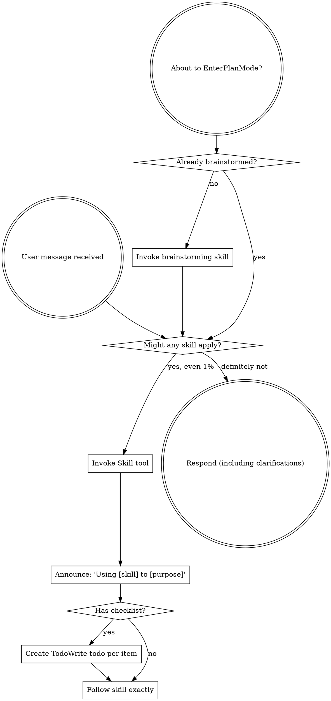

<!-- Generated by SpecStory, Markdown v2.1.0 -->

# 2026-07-03 00:36:04Z

<!-- Codex CLI Session 019f2567-63ef-7aa1-bf48-b7baa12aafff (2026-07-03 00:36:04Z) -->

_**User (2026-07-03 00:36:04Z)**_

generate an image of a black pug fiercely and bravely dog play fighting with a pitbull

---

_**Agent (gpt-5.5 2026-07-03 00:36:17Z)**_

I’ll use the `imagegen` skill for this and keep the scene clearly playful and non-injurious while preserving the “fierce and brave” vibe.

_**Agent (gpt-5.5 2026-07-03 00:36:17Z)**_

<tool-use data-tool-type="shell" data-tool-name="exec_command"><details>
<summary>Tool use: **exec_command** `sed -n '1,220p' /Users/nicholas/.codex/plugins/cache/openai-curated/superpowers/3fdeeb49/skills/using-superpowers/SKILL.md`</summary>
```
Chunk ID: 7fb08c
Wall time: 0.0000 seconds
Process exited with code 0
Original token count: 1356
Output:
---
name: using-superpowers
description: Use when starting any conversation - establishes how to find and use skills, requiring Skill tool invocation before ANY response including clarifying questions
---

<SUBAGENT-STOP>
If you were dispatched as a subagent to execute a specific task, skip this skill.
</SUBAGENT-STOP>

<EXTREMELY-IMPORTANT>
If you think there is even a 1% chance a skill might apply to what you are doing, you ABSOLUTELY MUST invoke the skill.

IF A SKILL APPLIES TO YOUR TASK, YOU DO NOT HAVE A CHOICE. YOU MUST USE IT.

This is not negotiable. This is not optional. You cannot rationalize your way out of this.
</EXTREMELY-IMPORTANT>

## Instruction Priority

Superpowers skills override default system prompt behavior, but **user instructions always take precedence**:

1. **User's explicit instructions** (CLAUDE.md, GEMINI.md, AGENTS.md, direct requests) — highest priority
2. **Superpowers skills** — override default system behavior where they conflict
3. **Default system prompt** — lowest priority

If CLAUDE.md, GEMINI.md, or AGENTS.md says "don't use TDD" and a skill says "always use TDD," follow the user's instructions. The user is in control.

## How to Access Skills

**In Claude Code:** Use the `Skill` tool. When you invoke a skill, its content is loaded and presented to you—follow it directly. Never use the Read tool on skill files.

**In Copilot CLI:** Use the `skill` tool. Skills are auto-discovered from installed plugins. The `skill` tool works the same as Claude Code's `Skill` tool.

**In Gemini CLI:** Skills activate via the `activate_skill` tool. Gemini loads skill metadata at session start and activates the full content on demand.

**In other environments:** Check your platform's documentation for how skills are loaded.

## Platform Adaptation

Skills use Claude Code tool names. Non-CC platforms: see `references/copilot-tools.md` (Copilot CLI), `references/codex-tools.md` (Codex) for tool equivalents. Gemini CLI users get the tool mapping loaded automatically via GEMINI.md.

# Using Skills

## The Rule

**Invoke relevant or requested skills BEFORE any response or action.** Even a 1% chance a skill might apply means that you should invoke the skill to check. If an invoked skill turns out to be wrong for the situation, you don't need to use it.



## Red Flags

These thoughts mean STOP—you're rationalizing:

| Thought | Reality |
|---------|---------|
| "This is just a simple question" | Questions are tasks. Check for skills. |
| "I need more context first" | Skill check comes BEFORE clarifying questions. |
| "Let me explore the codebase first" | Skills tell you HOW to explore. Check first. |
| "I can check git/files quickly" | Files lack conversation context. Check for skills. |
| "Let me gather information first" | Skills tell you HOW to gather information. |
| "This doesn't need a formal skill" | If a skill exists, use it. |
| "I remember this skill" | Skills evolve. Read current version. |
| "This doesn't count as a task" | Action = task. Check for skills. |
| "The skill is overkill" | Simple things become complex. Use it. |
| "I'll just do this one thing first" | Check BEFORE doing anything. |
| "This feels productive" | Undisciplined action wastes time. Skills prevent this. |
| "I know what that means" | Knowing the concept ≠ using the skill. Invoke it. |

## Skill Priority

When multiple skills could apply, use this order:

1. **Process skills first** (brainstorming, debugging) - these determine HOW to a
... (truncated)
```
</details></tool-use>

_**Agent (gpt-5.5 2026-07-03 00:36:17Z)**_

<tool-use data-tool-type="shell" data-tool-name="exec_command"><details>
<summary>Tool use: **exec_command** `sed -n '1,220p' /Users/nicholas/.codex/skills/.system/imagegen/SKILL.md`</summary>
```
Chunk ID: 730aeb
Wall time: 0.0000 seconds
Process exited with code 0
Original token count: 4187
Output:
---
name: "imagegen"
description: "Generate or edit raster images when the task benefits from AI-created bitmap visuals such as photos, illustrations, textures, sprites, mockups, or transparent-background cutouts. Use when Codex should create a brand-new image, transform an existing image, or derive visual variants from references, and the output should be a bitmap asset rather than repo-native code or vector. Do not use when the task is better handled by editing existing SVG/vector/code-native assets, extending an established icon or logo system, or building the visual directly in HTML/CSS/canvas."
---

# Image Generation Skill

Generates or edits images for the current project (for example website assets, game assets, UI mockups, product mockups, wireframes, logo design, photorealistic images, or infographics).

## Top-level modes and rules

This skill has exactly two top-level modes:

- **Default built-in tool mode (preferred):** built-in `image_gen` tool for normal image generation, editing, and simple transparent-image requests. Does not require `OPENAI_API_KEY`.
- **Fallback CLI mode:** `scripts/image_gen.py` CLI. Use when the user explicitly asks for the CLI/API/model path, or after the user explicitly confirms a true model-native transparency fallback with `gpt-image-1.5`. Requires `OPENAI_API_KEY`.

Within CLI fallback, the CLI exposes three subcommands:

- `generate`
- `edit`
- `generate-batch`

Rules:
- Use the built-in `image_gen` tool by default for normal image generation and editing requests.
- Do not switch to CLI fallback for ordinary quality, size, or file-path control.
- If the user explicitly asks for a transparent image/background, stay on built-in `image_gen` first: prompt for a flat removable chroma-key background, then remove it locally with the installed helper at `$CODEX_HOME/skills/.system/imagegen/scripts/remove_chroma_key.py`.
- Never silently switch from built-in `image_gen` or CLI `gpt-image-2` to CLI `gpt-image-1.5`. Treat this as a model/path downgrade and ask the user before doing it, unless the user has already explicitly requested `gpt-image-1.5`, `scripts/image_gen.py`, or CLI fallback.
- If a transparent request appears too complex for clean chroma-key removal, asks for true/native transparency, or local removal fails validation, explain that true transparency requires CLI `gpt-image-1.5 --background transparent --output-format png` because `gpt-image-2` does not support `background=transparent`, then ask whether to proceed. Run the CLI fallback only after the user confirms.
- The word `batch` by itself does not mean CLI fallback. If the user asks for many assets or says to batch-generate assets without explicitly asking for CLI/API/model controls, stay on the built-in path and issue one built-in call per requested asset or variant.
- If the built-in tool fails or is unavailable, tell the user the CLI fallback exists and that it requires `OPENAI_API_KEY`. Proceed only if the user explicitly asks for that fallback.
- If the user explicitly asks for CLI mode, use the bundled `scripts/image_gen.py` workflow. Do not create one-off SDK runners.
- Never modify `scripts/image_gen.py`. If something is missing, ask the user before doing anything else.

Built-in save-path policy:
- In built-in tool mode, Codex saves generated images under `$CODEX_HOME/*` by default.
- Do not describe or rely on OS temp as the default built-in destination.
- Do not describe or rely on a destination-path argument (if any) on the built-in `image_gen` tool. If a specific location is needed, generate first and then move or copy the selected output from `$CODEX_HOME/generated_images/...`.
- Save-path precedence in built-in mode:
  1. If the user names a destination, move or copy the selected output there.
  2. If the image is meant for the current project, move or copy the final selected image into the workspace before finishing.
  3. If the image is only for preview or brainstorming, render it inline; the underlying file can remain at the default `$CODEX_HOME/*` path.
- Never leave a project-referenced asset only at the default `$CODEX_HOME/*` path.
- Do not overwrite an existing asset unless the user explicitly asked for replacement; otherwise create a sibling versioned filename such as `hero-v2.png` or `item-icon-edited.png`.

Shared prompt guidance for both modes lives in `references/prompting.md` and `references/sample-prompts.md`.

Fallback-only docs/resources for CLI mode:
- `references/cli.md`
- `references/image-api.md`
- `references/codex-network.md`
- `scripts/image_gen.py`

Local post-processing helper:
- `$CODEX_HOME/skills/.system/imagegen/scripts/remove_chroma_key.py`: removes a flat chroma-key background from a generated image and writes a PNG/WebP with alpha. Prefer auto-key sampling, soft matte, and despill for antialiased edges.

## When to use
- Generate a new image (concept art,
... (truncated)
```
</details></tool-use>

_**Agent (gpt-5.5 2026-07-03 00:36:22Z)**_

<tool-use data-tool-type="shell" data-tool-name="exec_command"><details>
<summary>Tool use: **exec_command** `sed -n '221,520p' /Users/nicholas/.codex/skills/.system/imagegen/SKILL.md`</summary>
```
Chunk ID: 0ed4bb
Wall time: 0.0000 seconds
Process exited with code 0
Original token count: 1814
Output:
Style/medium: <photo/illustration/3D/etc>
Composition/framing: <wide/close/top-down; placement>
Lighting/mood: <lighting + mood>
Color palette: <palette notes>
Materials/textures: <surface details>
Text (verbatim): "<exact text>"
Constraints: <must keep/must avoid>
Avoid: <negative constraints>
```

Notes:
- `Asset type` and `Input images` are prompt scaffolding, not dedicated CLI flags.
- `Scene/backdrop` refers to the visual setting. It is not the same as the fallback CLI `background` parameter, which controls output transparency behavior.
- Fallback-only execution notes such as `Quality:`, `Input fidelity:`, masks, output format, and output paths belong in the CLI path only. Do not treat them as built-in `image_gen` tool arguments.

Augmentation rules:
- Keep it short.
- Add only the details needed to improve the prompt materially.
- For edits, explicitly list invariants (`change only X; keep Y unchanged`).
- If any critical detail is missing and blocks success, ask a question; otherwise proceed.

## Examples

### Generation example (hero image)
```text
Use case: product-mockup
Asset type: landing page hero
Primary request: a minimal hero image of a ceramic coffee mug
Style/medium: clean product photography
Composition/framing: wide composition with usable negative space for page copy if needed
Lighting/mood: soft studio lighting
Constraints: no logos, no text, no watermark
```

### Edit example (invariants)
```text
Use case: precise-object-edit
Asset type: product photo background replacement
Primary request: replace only the background with a warm sunset gradient
Constraints: change only the background; keep the product and its edges unchanged; no text; no watermark
```

## Prompting best practices
- Structure prompt as scene/backdrop -> subject -> details -> constraints.
- Include intended use (ad, UI mock, infographic) to set the mode and polish level.
- Use camera/composition language for photorealism.
- Only use SVG/vector stand-ins when the user explicitly asked for vector output or a non-image placeholder.
- Quote exact text and specify typography + placement.
- For tricky words, spell them letter-by-letter and require verbatim rendering.
- For multi-image inputs, reference images by index and describe how they should be used.
- For edits, repeat invariants every iteration to reduce drift.
- Iterate with single-change follow-ups.
- If the prompt is generic, add only the extra detail that will materially help.
- If the prompt is already detailed, normalize it instead of expanding it.
- For CLI fallback only, see `references/cli.md` and `references/image-api.md` for model, `quality`, `input_fidelity`, masks, output format, and output-path guidance.
- For transparent images, use the built-in-first chroma-key workflow unless the request is complex enough to need true CLI transparency; ask before switching to CLI `gpt-image-1.5`.

More principles shared by both modes: `references/prompting.md`.
Copy/paste specs shared by both modes: `references/sample-prompts.md`.

## Guidance by asset type
Asset-type templates (website assets, game assets, wireframes, logo) are consolidated in `references/sample-prompts.md`.

## gpt-image-2 guidance for CLI fallback

The fallback CLI defaults to `gpt-image-2`.

- Use `gpt-image-2` for new CLI/API workflows unless the request needs true model-native transparent output.
- If a transparent request may need CLI fallback, ask before using `gpt-image-1.5` unless the user already explicitly requested `gpt-image-1.5`, `scripts/image_gen.py`, or CLI fallback. Explain that the built-in chroma-key path is the default, but true transparency requires `gpt-image-1.5` because `gpt-image-2` does not support `background=transparent`.
- `gpt-image-2` always uses high fidelity for image inputs; do not set `input_fidelity` with this model.
- `gpt-image-2` supports `quality` values `low`, `medium`, `high`, and `auto`.
- Use `quality low` for fast drafts, thumbnails, and quick iterations. Use `medium`, `high`, or `auto` for final assets, dense text, diagrams, identity-sensitive edits, or high-resolution outputs.
- Square images are typically fastest to generate. Use `1024x1024` for fast square drafts.
- If the user asks for 4K-style output, use `3840x2160` for landscape or `2160x3840` for portrait.
- `gpt-image-2` size may be `auto` or `WIDTHxHEIGHT` if all constraints hold: max edge `<= 3840px`, both edges multiples of `16px`, long-to-short ratio `<= 3:1`, total pixels between `655,360` and `8,294,400`.

Popular `gpt-image-2` sizes:
- `1024x1024` square
- `1536x1024` landscape
- `1024x1536` portrait
- `2048x2048` 2K square
- `2048x1152` 2K landscape
- `3840x2160` 4K landscape
- `2160x3840` 4K portrait
- `auto`

## Fallback CLI mode only

### Temp and output conventions
These conventions apply only to the CLI fallback. They do not describe built-in `image_gen` output behavior.
- Use `t
... (truncated)
```
</details></tool-use>

_**Agent (gpt-5.5 2026-07-03 00:37:35Z)**_

Done. I kept it playful and brave rather than violent.
