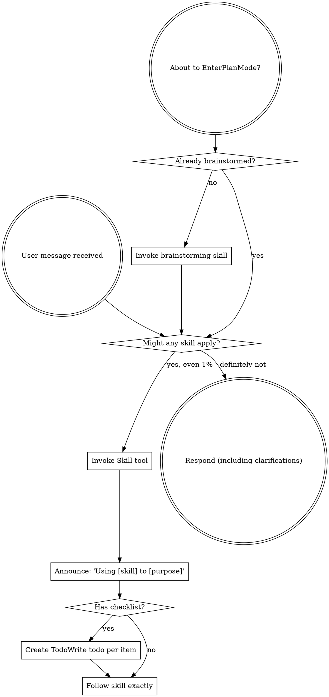

<!-- Generated by SpecStory, Markdown v2.1.0 -->

# 2026-07-07 04:11:39Z

<!-- Codex CLI Session 019f3ac6-2495-7860-b5e3-71b4f17ef191 (2026-07-07 04:11:39Z) -->

_**User (2026-07-07 04:11:39Z)**_

System instructions:
Generate a commit message from the current staged and unstaged working-copy changes. Obey further instructions from the user prompt. Inspect only `git status --short`, `git diff --staged`, and `git diff`. Do not read repository files directly. Do not inspect commit history, blame, or unrelated repository context. Once you have enough evidence from those commands, return the final JSON immediately with no additional exploration. Finish in one pass whenever possible. Never exceed 2 reasoning or tool rounds. Prefer direct final output over exploration. Always return exactly one JSON object matching the provided schema and nothing else. The subject value must contain only the commit subject line. The body value must contain only the optional commit body text, or an empty string. Never put labels, explanations, markdown, code fences, status text, surrounding prose, or example JSON inside either field. If repository data is missing or there are no changes, still return a best-effort commit-message JSON object.

---
User prompt:
Use conventional commits and emojis

Use only staged changes to create the commit message.

---

_**Agent (gpt-5.5 2026-07-07 04:11:58Z)**_

<tool-use data-tool-type="shell" data-tool-name="exec_command"><details>
<summary>Tool use: **exec_command** `sed -n '1,220p' /Users/nicholas/.codex/plugins/cache/openai-curated/superpowers/d6169bef/skills/using-superpowers/SKILL.md`</summary>
```
Chunk ID: 236c06
Wall time: 0.0003 seconds
Process exited with code 0
Original token count: 1356
Output:
---
name: using-superpowers
description: Use when starting any conversation - establishes how to find and use skills, requiring Skill tool invocation before ANY response including clarifying questions
---

<SUBAGENT-STOP>
If you were dispatched as a subagent to execute a specific task, skip this skill.
</SUBAGENT-STOP>

<EXTREMELY-IMPORTANT>
If you think there is even a 1% chance a skill might apply to what you are doing, you ABSOLUTELY MUST invoke the skill.

IF A SKILL APPLIES TO YOUR TASK, YOU DO NOT HAVE A CHOICE. YOU MUST USE IT.

This is not negotiable. This is not optional. You cannot rationalize your way out of this.
</EXTREMELY-IMPORTANT>

## Instruction Priority

Superpowers skills override default system prompt behavior, but **user instructions always take precedence**:

1. **User's explicit instructions** (CLAUDE.md, GEMINI.md, AGENTS.md, direct requests) — highest priority
2. **Superpowers skills** — override default system behavior where they conflict
3. **Default system prompt** — lowest priority

If CLAUDE.md, GEMINI.md, or AGENTS.md says "don't use TDD" and a skill says "always use TDD," follow the user's instructions. The user is in control.

## How to Access Skills

**In Claude Code:** Use the `Skill` tool. When you invoke a skill, its content is loaded and presented to you—follow it directly. Never use the Read tool on skill files.

**In Copilot CLI:** Use the `skill` tool. Skills are auto-discovered from installed plugins. The `skill` tool works the same as Claude Code's `Skill` tool.

**In Gemini CLI:** Skills activate via the `activate_skill` tool. Gemini loads skill metadata at session start and activates the full content on demand.

**In other environments:** Check your platform's documentation for how skills are loaded.

## Platform Adaptation

Skills use Claude Code tool names. Non-CC platforms: see `references/copilot-tools.md` (Copilot CLI), `references/codex-tools.md` (Codex) for tool equivalents. Gemini CLI users get the tool mapping loaded automatically via GEMINI.md.

# Using Skills

## The Rule

**Invoke relevant or requested skills BEFORE any response or action.** Even a 1% chance a skill might apply means that you should invoke the skill to check. If an invoked skill turns out to be wrong for the situation, you don't need to use it.



## Red Flags

These thoughts mean STOP—you're rationalizing:

| Thought | Reality |
|---------|---------|
| "This is just a simple question" | Questions are tasks. Check for skills. |
| "I need more context first" | Skill check comes BEFORE clarifying questions. |
| "Let me explore the codebase first" | Skills tell you HOW to explore. Check first. |
| "I can check git/files quickly" | Files lack conversation context. Check for skills. |
| "Let me gather information first" | Skills tell you HOW to gather information. |
| "This doesn't need a formal skill" | If a skill exists, use it. |
| "I remember this skill" | Skills evolve. Read current version. |
| "This doesn't count as a task" | Action = task. Check for skills. |
| "The skill is overkill" | Simple things become complex. Use it. |
| "I'll just do this one thing first" | Check BEFORE doing anything. |
| "This feels productive" | Undisciplined action wastes time. Skills prevent this. |
| "I know what that means" | Knowing the concept ≠ using the skill. Invoke it. |

## Skill Priority

When multiple skills could apply, use this order:

1. **Process skills first** (brainstorming, debugging) - these determine HOW to a
... (truncated)
```
</details></tool-use>

_**Agent (gpt-5.5 2026-07-07 04:12:02Z)**_

<tool-use data-tool-type="shell" data-tool-name="exec_command"><details>
<summary>Tool use: **exec_command** `git status --short`</summary>

**Input:**

- cmd: `git status --short`
- command: `git status --short`
- max_output_tokens: `12000`
- workdir: `/Users/nicholas/develop/llm-firehose`
- yield_time_ms: `10000`

</details></tool-use>

_**Agent (gpt-5.5 2026-07-07 04:12:02Z)**_

<tool-use data-tool-type="shell" data-tool-name="exec_command"><details>
<summary>Tool use: **exec_command** `git diff --staged`</summary>

**Input:**

- cmd: `git diff --staged`
- command: `git diff --staged`
- max_output_tokens: `60000`
- workdir: `/Users/nicholas/develop/llm-firehose`
- yield_time_ms: `10000`

</details></tool-use>
