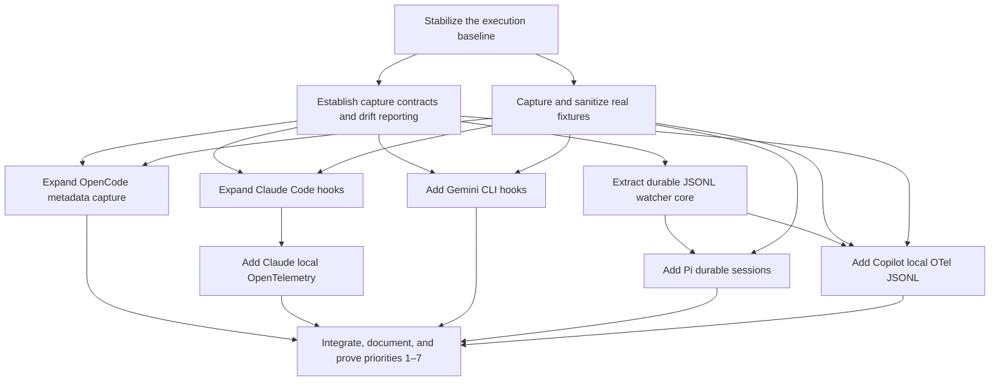

# Agent Capture Expansion Implementation Plan

**Status:** Ready to execute after the current dirty checkout is stabilized.

**Research basis:** [Agent capture surface research](../research/2026-07-25-agent-capture-surface-research.md)

## Destination

Agent Firehose safely captures the high-value metadata available from
OpenCode, Claude Code hooks and local OpenTelemetry, Gemini CLI, Pi, and GitHub
Copilot CLI, while preserving the frozen schema/privacy/spool/export/API
contracts, daemon-optional capture, and fail-silent agent behavior.

The destination is reached when priorities 1–7 are implemented with real
captured fixtures, focused and full repository gates, daemon-on and
daemon-off proof, privacy-negative tests, documented capture fidelity, and no
unexplained upstream event drops.

## Notes

- Work from a new `codex/agent-capture-expansion` worktree after the current
  `feat/daemon-desktop-migration` work is committed or recovery-backed. Do not
  build these changes on top of an unresolved mixed staged/unstaged checkout.
- TDD is mandatory. Adapter tests use sanitized real payloads captured from
  the exact supported upstream version; invented event shapes are prohibited.
- The spool remains the canonical append-only truth. Every durable watcher
  appends successfully before advancing its cursor.
- Capture must never block or crash an agent. Hook commands always return a
  neutral response and exit zero; observation-only hooks must be asynchronous
  where the upstream supports that.
- No cloud service, account, sync, or Firehose telemetry is introduced.
- No content-bearing upstream telemetry option is enabled by default.
- No new Go dependency is planned. Claude supports OTLP `http/json`, which can
  be decoded with the standard library.
- Optional envelope fields are additive within schema v1. Any removal,
  rename, changed meaning, or privacy-mode semantic change is a STOP requiring
  a schema/version migration decision.
- Merges to `main` remain human-approved.

## Decisions so far

- [Capture surface research](../research/2026-07-25-agent-capture-surface-research.md)
  establishes the source priority: foundation, OpenCode, Claude hooks, Claude
  local OpenTelemetry, Gemini hooks, Pi durable sessions, Copilot CLI.
- Hooks and durable files remain the baseline. OpenTelemetry is supplemental
  enrichment and may be unavailable while the daemon is down.
- New mappings retain metadata in `payload`; high-risk content remains only in
  `raw`, which the existing balanced/minimal modes already drop. Existing
  privacy-mode meanings are not silently redefined.
- OpenCode continues to use its supported plugin event callback; storage files
  are not a primary transport.
- Pi uses its versioned v3 session JSONL. The optional live extension is
  outside this plan.
- Copilot uses its supported local OTel JSONL exporter plus non-blocking
  lifecycle hooks. Internal recovery `events.jsonl` is not a primary contract.

## Dependency map



## Work map

### Stabilize the execution baseline

**Question resolved:** What exact committed state do priorities 1–7 build on?

**Blocked by:** Nothing.

**Work:**

1. Inventory the current branch, staged/unstaged files, untracked files,
   worktrees, and commits ahead of upstream.
2. Finish or recovery-bundle the current daemon/durability work without
   folding unrelated WIP into this effort.
3. Run the existing baseline gates:

   ```sh
   gofmt -l .
   go vet ./...
   go test ./...
   scripts/build-sidecar.sh
   pnpm -C apps/tauri-desktop test
   pnpm -C apps/tauri-desktop build
   cargo test --manifest-path apps/tauri-desktop/src-tauri/Cargo.toml
   ```

4. Create an isolated worktree and branch from the verified committed base.
5. Record the base commit and locally observed agent versions at the top of
   this plan when execution begins.

**Acceptance evidence:**

- Source worktree is preserved and recoverable.
- Expansion worktree starts clean.
- Baseline gates are green, or any pre-existing failure is recorded with exact
  output before expansion work begins.

### Capture and sanitize real fixtures

**Question resolved:** Which upstream shapes are proven rather than inferred?

**Blocked by:** Stabilize the execution baseline.

**Files:**

- Add: `internal/adapters/opencode/testdata/`
- Add: `internal/adapters/claudecode/testdata/`
- Add: `internal/adapters/gemini/testdata/`
- Later add: `internal/adapters/pi/testdata/`
- Later add: `internal/adapters/copilot/testdata/`
- Add a `README.md` beside each fixture set.

**Fixture protocol:**

1. Capture payloads from the installed product without passing through the
   adapter being tested.
2. Record product version, operating system, transport, trigger action, and
   capture date.
3. Sanitize values only. Preserve keys, nesting, types, optional-field
   presence, and event ordering.
4. Replace prompts, responses, file contents, tool output, credentials,
   emails, account/organization IDs, and absolute personal paths.
5. Run a secret/path/email scan over every fixture before commit.
6. Capture malformed, optional-field-absent, and large-but-bounded examples
   from real behavior where the upstream can produce them.

**Required fixture matrix:**

| Source | Minimum proven fixtures |
| --- | --- |
| OpenCode 1.18.x | session create/status/idle/error/compact; user and completed assistant message; terminal tool success/error; step finish; permission request/reply; retry; file/VCS; PTY exit |
| Claude Code 2.1.218+ | common fields; pre/post/failing tool; permission request/denied; session start/end; subagent/task; notification types; stop/failure; pre/post compact; CWD/config/file/worktree; elicitation |
| Gemini CLI 0.46.x | all 11 hook types, with before/after model payloads sanitized but structurally intact |
| Pi | v3 header plus message/tool/model/compaction/branch/session-info entries and a file append across restart |
| Copilot CLI | local OTel JSONL session/model/tool/usage/compaction records and the selected non-blocking hook payloads |

**STOP conditions:**

- Pi or Copilot is not installed and no real local fixture can be captured.
- Authentication or a paid model call is required without explicit approval.
- A fixture cannot be sanitized without changing its structural meaning.

An unavailable fixture blocks only its adapter milestone; it does not justify
inventing a payload.

---

## Priority 1 — Capture contracts, privacy allowlists, and drift reporting

### Establish capture contracts and drift reporting

**Goal:** Make correlation, transport fidelity, filtering, and upstream drift
explicit before expanding any adapter.

**Blocked by:** Stabilize the execution baseline.

**Files:**

- Modify: `internal/event/event.go`
- Modify: `internal/event/event_test.go`
- Modify: `internal/event/schema_doc_test.go`
- Modify: `docs/event.schema.json`
- Modify: `docs/contracts.md`
- Add: `internal/capturemeta/capturemeta.go`
- Add: `internal/capturemeta/capturemeta_test.go`
- Modify: `internal/cli/doctor.go`
- Modify: `internal/cli/cli_test.go`
- Add: `docs/adapter-capabilities.md`
- Modify: `docs/adapters.md`

**Additive envelope fields:**

| Field | Type | Meaning |
| --- | --- | --- |
| `upstream_event_id` | string | Stable ID assigned to the native event record |
| `prompt_id` | string | Native prompt/interaction correlation ID |
| `message_id` | string | Native user/assistant message ID |
| `parent_id` | string | Native parent record/message/session ID |
| `request_id` | string | Native model/API request ID |
| `sequence` | optional integer | Native ordering value within its documented source scope |
| `transport` | string | `hook`, `plugin`, `otel-http`, `otel-jsonl`, `durable-jsonl`, or `process` |
| `source_version` | string | Upstream product/schema version when actually supplied or observed |

Do not promote model, provider, duration, token classes, cost, status, or
finish reason yet. Their source semantics vary; keep them in typed,
source-specific payloads until the implemented adapters demonstrate a stable
cross-source definition.

**Capture metadata API:**

Create `internal/capturemeta` with:

```go
type Fidelity string

const (
    SupportedPassiveStream Fidelity = "supported-passive-stream"
    SupportedInBandHook    Fidelity = "supported-in-band-hook"
    PassiveVersionedFile   Fidelity = "passive-versioned-file"
    PassiveInternalFile    Fidelity = "passive-internal-file"
    OwnedRunProtocol       Fidelity = "owned-run-protocol"
    ProcessOnly            Fidelity = "process-only"
)

type Manifest struct {
    Source       string
    Transport    string
    Fidelity     Fidelity
    Mapped       []string
    Filtered     []string
    SourceSchema string
}
```

Each deep adapter exports a manifest. `doctor` reports wiring plus transport,
fidelity, supported-event count, and deliberately filtered-event count using
additive response fields.

**Drift behavior:**

- Unknown native event types become `category=meta`,
  `name=adapter.unknown_event`, `severity=warn`.
- The warning payload contains only source, transport, native event name,
  source version, and a bounded reason.
- Unknown warnings use a stable ID derived from source, version, native type,
  and UTC day so the derived index/presentation deduplicates repeated
  observations.
- Deliberately filtered high-volume events return a documented skip, not a
  warning.
- Malformed payloads retain the existing fail-silent hook behavior and append
  a safe `hook_capture_error` warning without raw input or secrets.
- OpenCode's long-lived plugin and durable watchers keep a per-process set so
  they forward at most one unknown warning per native type per run.

**Privacy convention:**

- Adapters construct payloads from explicit safe-key allowlists.
- Prompts, responses, reasoning, system instructions, tool bodies, diffs,
  file contents, headers, elicitation values, identity attributes, and share/
  auth URLs are not copied into newly mapped payloads.
- The untouched source record may remain in `raw`; the existing balanced and
  minimal modes drop it, while full mode keeps it by its existing contract.
- Do not change the existing three privacy modes in this milestone.
- Add tests proving a marker secret present in a raw fixture is absent from
  balanced/minimal spool output and present only in full mode.

**TDD sequence:**

1. Add failing JSON round-trip and schema-document tests for every optional
   envelope field.
2. Add failing validation tests for manifest source/transport/fidelity and
   duplicate mapped/filtered names.
3. Add failing unknown-event helper tests for stable ID, bounded payload, and
   absence of raw content.
4. Implement the smallest event/capturemeta changes.
5. Extend `doctor` response tests without changing existing fields.
6. Update contract and adapter capability documentation.

**Acceptance evidence:**

- Old schema-v1 spool lines still unmarshal.
- Generic ingest preserves the new optional fields.
- Existing export remains byte-order compatible and version 1.
- No privacy mode changes meaning.
- Unknown and deliberately skipped events are distinguishable.
- Full Go gates pass.

**Suggested commit:** `feat(capture): add correlation, fidelity, and drift metadata`

---

## Priority 2 — Expand OpenCode metadata capture

### Expand OpenCode's existing plugin and parser

**Goal:** Capture the high-signal portion of the event bus Firehose already
receives, without spawning a forwarding process for text/reasoning deltas or
partial tool updates.

**Blocked by:** Establish capture contracts and drift reporting; OpenCode
fixture matrix.

**Files:**

- Modify: `internal/adapters/opencode/opencode.go`
- Modify: `internal/adapters/opencode/opencode_test.go`
- Modify: `internal/adapters/opencode/plugin.go`
- Add: `internal/adapters/opencode/plugin_test.go`
- Add: `internal/adapters/opencode/testdata/*`
- Modify: `internal/cli/cli_test.go`
- Modify: `docs/adapters.md`
- Modify: `docs/adapter-capabilities.md`

**Mapping slices:**

1. **Identity and time**
   - upstream event, session, message, parent, and call IDs;
   - nested source timestamps;
   - project, directory, provider, model, agent, mode, finish reason.
2. **Usage and completion**
   - input/output/reasoning/cache tokens and cost;
   - completed assistant messages;
   - step finish/failure, snapshot ID, changed-file counts.
3. **Tool lifecycle**
   - terminal success/error, call ID, title, start/end/duration;
   - safe output metadata such as byte count and output paths;
   - never store full arguments, result, attachments, or error bodies in the
     default payload.
4. **Session control**
   - busy/retry/idle, compaction, parent session, summary edit counts.
5. **Peripheral signal**
   - permission/question lifecycle, todos, commands, VCS branch, file watcher,
     PTY terminal state, bounded LSP diagnostic counts.

**Plugin-side filtering:**

- Skip text and reasoning deltas.
- Skip nonterminal tool input/progress updates unless they carry a new call ID
  needed to establish the start phase.
- Skip duplicate message updates that add no terminal state or usage.
- Forward every documented high-signal type.
- Forward one synthetic unknown-type observation per plugin run.
- Preserve fire-and-forget behavior and ignored stdout/stderr.

The generated plugin filter must be driven by the same mapped/filtered
manifest lists the Go parser tests use, so the two cannot drift silently.

**TDD sequence:**

1. Table-drive each real fixture against category, name, IDs, source time,
   severity, safe payload, and summary.
2. Prove partial tool/text/reasoning fixtures are deliberate skips.
3. Prove an unknown fixture creates one safe warning.
4. Prove secret markers in tool input/result do not survive balanced capture.
5. Add plugin rendering/filter tests.
6. Implement mappings in small event-family commits if necessary.

**Live acceptance:**

- Run an OpenCode session containing a shell command, file edit, permission,
  successful tool, failing tool, and retry/compaction if triggerable.
- With daemon running, observe correlated terminal events exactly once.
- With daemon stopped, repeat one tool action and prove direct spool capture.
- Confirm no text/reasoning delta process storm.
- Run full Go and desktop gates.

**Suggested commits:**

- `feat(opencode): capture correlated terminal and usage metadata`
- `perf(opencode): filter streaming noise before forwarding`

---

## Priority 3 — Expand Claude Code hooks

### Expand Claude Code hook coverage safely

**Goal:** Move from nine installed events to the complete current hook surface,
preserving native IDs/timing while never exercising a policy decision.

**Blocked by:** Establish capture contracts and drift reporting; Claude
fixture matrix.

**Files:**

- Modify: `internal/cli/install.go`
- Modify: `internal/cli/cli_test.go`
- Modify: `internal/cli/doctor.go`
- Modify: `internal/adapters/claudecode/claudecode.go`
- Modify: `internal/adapters/claudecode/claudecode_test.go`
- Add: `internal/adapters/claudecode/testdata/*`
- Modify: `internal/daemon/endpoints.go`
- Modify: `internal/daemon/endpoints_test.go`
- Modify: `docs/adapters.md`
- Modify: `docs/adapter-capabilities.md`

**Event families:**

- setup, session start/end, prompt submit/expansion;
- pre/post/failing/batched tools;
- permission request/denied;
- notifications and display metadata;
- subagent/task start/stop/completion and teammate idle;
- stop/stop failure;
- instructions/config/CWD/file/worktree changes;
- pre/post compaction;
- elicitation request/result.

`MessageDisplay` is registered only to retain turn/message IDs, delta index,
and final state. The delta text is never copied into the safe payload.

**Common fields:**

- `session_id`, `prompt_id`, `tool_use_id`, `turn_id`, `message_id`;
- source timestamp when supplied, transcript path, permission mode;
- effort level/downgrade, model, agent ID/type;
- duration, interrupt flag, error class, notification type.

**Installer behavior:**

1. Preserve unrelated settings and existing user hooks.
2. Add only Firehose-owned entries and remain idempotent.
3. Use correct per-event matcher rules; do not add ignored/invalid matchers.
4. Mark Firehose command hooks asynchronous where Claude supports async
   observation.
5. Keep the neutral `{}` hook output and zero exit behavior.
6. Doctor must detect partial/outdated Firehose coverage and recommend
   reinstall without declaring other user hooks unhealthy.

**TDD sequence:**

1. Replace inline invented payloads with real sanitized fixture tests.
2. Add a failing installer matrix covering every event, matcher rule,
   async flag, preservation, backup, and idempotency.
3. Add failing parser tables by event family.
4. Add privacy-negative tests for display delta, prompt, tool body, compact
   summary, elicitation value, and identity fields.
5. Implement event families incrementally.
6. Keep unknown/shape-drift failures fail-silent and visible.

**Live acceptance:**

- Reinstall into a temporary home and diff the merged settings.
- Install in the real home only after the temp-home diff is approved.
- Run a Claude session exercising common tool, permission, subagent, task,
  compaction, and worktree paths.
- Stop the daemon and prove hooks still append directly.
- Confirm a malformed hook payload returns `{}` and does not affect the agent.
- Run full Go and desktop gates.

**Suggested commits:**

- `feat(claude): preserve hook correlation and failure metadata`
- `feat(claude): install complete fail-silent hook coverage`

---

## Priority 4 — Add Claude local OpenTelemetry

### Add an opt-in localhost OTLP/HTTP JSON receiver

**Goal:** Enrich Claude events with request IDs, sequence, model, tokens, cost,
retry, decisions, hook timing, compaction, and attribution without capturing
content or depending on an external collector.

**Blocked by:** Expand Claude Code hook coverage.

**Files:**

- Add: `internal/adapters/claudeotel/claudeotel.go`
- Add: `internal/adapters/claudeotel/claudeotel_test.go`
- Add: `internal/adapters/claudeotel/testdata/*`
- Add: `internal/daemon/otel.go`
- Add: `internal/daemon/otel_test.go`
- Modify: `internal/daemon/daemon.go`
- Modify: `internal/cli/install.go`
- Modify: `internal/cli/cli_test.go`
- Modify: `internal/cli/doctor.go`
- Modify: `cmd/firehose/main.go`
- Modify: `internal/daemon/endpoints.go`
- Modify: desktop onboarding/settings adapter lists as needed
- Modify: `docs/contracts.md`
- Modify: `docs/adapters.md`
- Modify: `docs/adapter-capabilities.md`

**Protocol decision:**

- Accept OTLP `http/json` at `POST /v1/logs` and `POST /v1/metrics` on the
  existing loopback-only daemon.
- Do not implement gRPC or protobuf in this milestone.
- Limit request bodies, attribute counts, nesting, and string sizes before
  normalization.
- Return an OTLP-success response quickly even when an individual record is
  malformed; append a bounded Firehose warning rather than inducing exporter
  retry pressure in Claude.

**Allowlisted log metadata:**

- session/prompt/message/tool/request/client-request IDs and sequence;
- event name, model, query source, finish/error/retry class;
- latency, tool duration/success/error type, byte counts;
- input/output/cache token counts and cost;
- permission decision and source, permission-mode changes;
- skill/plugin/MCP/agent attribution without paths or identities;
- hook lifecycle result/duration;
- compaction trigger/result/pre-post token counts.

**Allowlisted metrics:**

- session count, token usage, cost usage, active time;
- lines added/removed, commit and pull-request counts;
- code-edit decisions.

Never retain resource attributes for email, account, organization,
installation/user identity, hostname, or machine identity.

**Opt-in installer:**

Add `firehose install claude-otel` and the matching daemon install target.
It may add these settings only when no existing user/managed OTel destination
is configured:

```text
CLAUDE_CODE_ENABLE_TELEMETRY=1
OTEL_LOGS_EXPORTER=otlp
OTEL_METRICS_EXPORTER=otlp
OTEL_EXPORTER_OTLP_LOGS_PROTOCOL=http/json
OTEL_EXPORTER_OTLP_METRICS_PROTOCOL=http/json
OTEL_EXPORTER_OTLP_LOGS_ENDPOINT=http://127.0.0.1:4517/v1/logs
OTEL_EXPORTER_OTLP_METRICS_ENDPOINT=http://127.0.0.1:4517/v1/metrics
```

Explicitly keep all content-bearing options disabled. Refuse to overwrite an
existing endpoint, exporter, protocol, header, certificate, or managed
telemetry setting. Do not edit shell profiles.

**Daemon-optional rule:**

Claude OTel is supplemental. If the daemon is absent, Claude hooks still
capture the canonical lifecycle/tool baseline. Doctor and the UI report the
telemetry enrichment as unavailable; they do not claim the whole Claude
adapter is down.

**TDD sequence:**

1. Capture real `http/json` batches from local Claude into a temporary dumb
   receiver before writing the parser.
2. Add failing fixture tests for OTLP resource/scope/log and metric nesting.
3. Add failing allowlist tests with identity and content marker attributes.
4. Add failing HTTP tests for size limits, malformed partial records, quick
   success responses, loopback/CORS policy, and spool persistence.
5. Add failing installer conflict/idempotency tests.
6. Implement logs first, then metrics.
7. Correlate hook and OTel observations by prompt/tool/request IDs; never
   coalesce different lifecycle phases.

**Live acceptance:**

- Enable the opt-in config against the local daemon.
- Run one Claude prompt with a successful and failing tool.
- Prove hook and OTel observations share prompt/tool IDs.
- Prove token/cost/model data appears without prompt, response, tool body, or
  identity data under balanced mode.
- Stop the daemon and confirm Claude continues normally and hook capture
  persists.
- Run full Go and desktop gates.

**Suggested commits:**

- `feat(claude-otel): receive safe local OTLP log metadata`
- `feat(claude-otel): capture usage metrics and opt-in configuration`

---

## Priority 5 — Add Gemini CLI hooks

### Add a deep Gemini hook adapter

**Goal:** Capture the safe metadata from Gemini's 11 official hooks using the
existing fail-silent hook-forward architecture.

**Blocked by:** Establish capture contracts and drift reporting; complete
Gemini fixture matrix.

**Files:**

- Add: `internal/adapters/gemini/gemini.go`
- Add: `internal/adapters/gemini/gemini_test.go`
- Add: `internal/adapters/gemini/testdata/*`
- Modify: `internal/cli/cli.go`
- Modify: `internal/cli/install.go`
- Modify: `internal/cli/doctor.go`
- Modify: `internal/cli/cli_test.go`
- Modify: `cmd/firehose/main.go`
- Modify: `internal/daemon/endpoints.go`
- Modify: `internal/daemon/endpoints_test.go`
- Modify: desktop onboarding/settings adapter lists
- Modify: `docs/adapters.md`
- Modify: `docs/adapter-capabilities.md`

**Hook coverage:**

- `BeforeTool`, `AfterTool`;
- `BeforeAgent`, `AfterAgent`;
- `BeforeModel`, `AfterModel`;
- `BeforeToolSelection`;
- `SessionStart`, `SessionEnd`;
- `Notification`, `PreCompress`.

**Safe metadata mapping:**

- session ID, source timestamp, CWD, transcript reference;
- tool/MCP server/name, completion/failure, duration if supplied;
- agent stop/retry state;
- model and safe generation settings;
- finish reason, safety-block flags;
- prompt/candidate/total token counts;
- selected-tool count/mode and compression trigger.

Never copy model messages, response text, thought summaries, raw tool input/
response, MCP URLs, headers, or credentials into the safe payload.

**Installer behavior:**

- Merge user-level Gemini settings with backup and idempotency.
- Preserve every existing hook and setting.
- Use the documented neutral response and zero exit.
- Install only observational Firehose behavior; never return a deny, rewrite,
  tool selection, or model mutation.
- Doctor detects complete/partial configuration.

**TDD and live acceptance:**

1. Table-drive all 11 real fixtures.
2. Prove source timestamps and session IDs survive.
3. Prove content/identity markers are absent under balanced/minimal.
4. Prove malformed input returns neutral output and writes a safe warning.
5. Test merge, backup, idempotency, and partial-install repair.
6. Exercise a real Gemini session with tool success/failure and model response.
7. Repeat one hook with daemon stopped.
8. Run full Go and desktop gates.

**Suggested commit:** `feat(gemini): add complete fail-silent hook adapter`

---

## Priority 6 — Add Pi durable session capture

### Extract a reusable durable JSONL watcher core

**Goal:** Reuse Codex's proven append-before-checkpoint durability behavior
without copying source-specific parsing into another watcher.

**Blocked by:** Establish capture contracts and drift reporting.

**Files:**

- Add: `internal/durablejsonl/watcher.go`
- Add: `internal/durablejsonl/watcher_test.go`
- Modify: `internal/adapters/codex/durable.go`
- Modify: `internal/adapters/codex/watcher.go`
- Modify: `internal/adapters/codex/codex_test.go`
- Modify: `internal/daemon/stream_test.go`

**Required semantics:**

- recursive discovery with an explicit file matcher;
- per-file identity, offset, and safe restart cursor;
- append event successfully before checkpoint;
- handle partial lines, truncation, rotation, migration/rewrite, and corrupt
  records without stopping the watcher;
- baseline pre-existing history at EOF by default;
- read a newly created session file from its beginning;
- never advance past a parser/persistence failure;
- stable IDs make crash-window replay idempotent in derived views.

First move Codex onto the shared core with zero observable behavior change.
All existing Codex durability/restart/privacy tests must remain green before Pi
is added.

**Suggested commit:** `refactor(capture): share crash-safe durable JSONL tailing`

### Add Pi v3 session watcher and parser

**Goal:** Capture new Pi session activity from its versioned append-only tree
without requiring Firehose to launch or proxy Pi.

**Blocked by:** Reusable durable JSONL watcher core; real Pi fixture matrix.

**Files:**

- Add: `internal/adapters/pi/pi.go`
- Add: `internal/adapters/pi/pi_test.go`
- Add: `internal/adapters/pi/durable.go`
- Add: `internal/adapters/pi/testdata/*`
- Modify: `internal/cli/cli.go` (`pi_sessions_dir`)
- Modify: `internal/cli/doctor.go`
- Modify: `internal/daemon/stream.go`
- Modify: `internal/daemon/stream_test.go`
- Modify: `cmd/firehose/main.go` daemonless watcher path
- Modify: desktop adapter/doctor surfaces
- Modify: `docs/adapters.md`
- Modify: `docs/adapter-capabilities.md`

**Mapping:**

- header: session ID, timestamp, CWD, parent session, format version;
- every entry: upstream ID, parent ID, source timestamp;
- message metadata: role, provider/model, stop/error, token classes, cost;
- tool metadata: call ID/name, success/error, nested-use count, duration/usage
  when available;
- model and thinking-level changes;
- compaction: trigger/provenance, tokens-before, first-kept entry, usage,
  summary size/hash only;
- branch: source entry, usage, abandoned-file counts, summary size/hash only;
- session info/name/label metadata under the safe allowlist.

Never place message/tool content, compaction/branch summaries, direct-shell
output, full-output paths, or custom extension details in the default payload.

**Capture lifecycle:**

- Default root: `~/.pi/agent/sessions`, configurable as `pi_sessions_dir`.
- Cursor state: `~/.agentfirehose/state/pi-cursors.json`.
- Existing files baseline at EOF on first enable; new files start at byte zero.
- `--no-session` and missing session root are reported by doctor as an
  observable coverage gap, not an adapter failure.
- Both daemon and daemonless TUI modes append to the canonical spool.

**TDD and live acceptance:**

1. Parse the real v3 fixture tree with exact parent causality.
2. Prove stable IDs and replay deduplication.
3. Prove append-before-checkpoint across injected persistence failure.
4. Prove partial line, rewrite/truncate, and new-file behavior.
5. Prove content markers do not survive balanced/minimal capture.
6. Run a live Pi session, branch, tool, and compaction if available.
7. Stop/restart Firehose mid-session and prove no committed line is lost.
8. Run full Go and desktop gates.

**Suggested commit:** `feat(pi): capture durable v3 session metadata`

---

## Priority 7 — Add GitHub Copilot CLI

### Add Copilot local OTel JSONL and non-blocking lifecycle hooks

**Goal:** Capture Copilot's supported local telemetry metadata without
depending on its internal recovery schema or putting Firehose in a
permission/tool decision path.

**Blocked by:** Establish capture contracts and drift reporting; reusable
durable JSONL watcher core; real Copilot fixture matrix.

**Files:**

- Add: `internal/adapters/copilot/copilot.go`
- Add: `internal/adapters/copilot/copilot_test.go`
- Add: `internal/adapters/copilot/durable.go`
- Add: `internal/adapters/copilot/hooks.go`
- Add: `internal/adapters/copilot/testdata/*`
- Modify: `internal/cli/cli.go` (`copilot_otel_path`)
- Modify: `internal/cli/install.go`
- Modify: `internal/cli/doctor.go`
- Modify: `internal/cli/cli_test.go`
- Modify: `internal/daemon/stream.go`
- Modify: `internal/daemon/stream_test.go`
- Modify: `cmd/firehose/main.go`
- Modify: `internal/daemon/endpoints.go`
- Modify: desktop adapter/doctor surfaces
- Modify: `docs/adapters.md`
- Modify: `docs/adapter-capabilities.md`

**Primary transport:**

- Tail the supported file configured by
  `COPILOT_OTEL_FILE_EXPORTER_PATH`.
- Do not parse `~/.copilot/session-state/*/events.jsonl` as a public contract.
- Do not edit shell profiles. `firehose install copilot` writes safe lifecycle
  hooks and returns the exact environment/config instruction needed to enable
  the local OTel file.

**Allowlisted OTel metadata:**

- session/conversation/turn/response/interaction/tool-call/request IDs;
- agent name/version, requested/resolved model/provider, finish state;
- prompt/completion/cache token classes, turn count, cost, AI units;
- time to first token, server/tool duration, success/error class;
- MCP connection count/name without endpoints or credentials;
- lines changed, hook lifecycle, compaction/truncation counts;
- skill/plugin attribution without sensitive paths;
- shutdown totals and modified-file counts.

Content capture stays disabled. Drop prompts, responses, tool arguments/results,
user identity, share URLs, paths outside the configured path policy, and all
headers/tokens.

**Hook safety decision:**

Do not install Copilot `preToolUse` or `permissionRequest` hooks by default.
Copilot can treat failures in decision-capable hooks as denials, and a moved or
missing Firehose binary must never block a tool. Install only documented
non-decision lifecycle/post events that remain non-blocking if the command
fails. Tool start/decision metadata comes from OTel.

Candidate hook coverage:

- session start/end;
- user prompt submitted/transformed metadata without text;
- post-tool success/failure;
- agent/subagent start/stop;
- errors, pre-compact, notifications.

If current Copilot documentation or real failure tests show any candidate hook
can affect execution, omit it and record the gap in the capability manifest.

**TDD and live acceptance:**

1. Parse real local OTel JSONL fixtures.
2. Prove stable correlation, source time, cursor restart, and truncation
   handling.
3. Prove identity/content markers are absent under balanced/minimal.
4. Test hook config merge, backup, idempotency, and executable-path quoting.
5. Test selected hook commands returning neutral success on malformed input.
6. In a disposable temp home, point hooks to a missing executable and verify
   the chosen event set cannot block a Copilot tool/session.
7. Run a live session with model/tool/usage/compaction events.
8. Stop/restart Firehose and prove the OTel file catches up durably.
9. Run full Go and desktop gates.

**Suggested commits:**

- `feat(copilot): capture safe local OTel JSONL metadata`
- `feat(copilot): install non-blocking lifecycle hooks`

---

## Integration checkpoint

### Integrate, document, and prove priorities 1–7

**Blocked by:** OpenCode, Claude hooks, Claude OTel, Gemini, Pi, and Copilot
milestones.

**Files:**

- Modify: `README.md`
- Modify: `docs/contracts.md`
- Modify: `docs/adapters.md`
- Modify: `docs/adapter-capabilities.md`
- Modify: `docs/compatibility.md` if desktop/daemon minimums change
- Modify: desktop onboarding, doctor, settings, and source labels
- Add or update release notes

**Cross-source contract tests:**

- optional envelope fields survive spool, export, index rebuild, API, client,
  and desktop parsing;
- same native call observed through two transports correlates without merging
  different start/end phases;
- stable IDs deduplicate crash replay in index/presentation while export keeps
  append-only observations;
- source/capture time semantics are consistent;
- every source has an explicit manifest and no silent unknown default;
- balanced/minimal negative corpus contains no prompt, reasoning, tool body,
  header, credential, elicitation value, identity, or share URL marker;
- full mode behavior remains exactly as documented;
- daemon-off hooks/watchers still append; supplemental OTel unavailability is
  clearly reported rather than misrepresented as total adapter failure.

**Final validation:**

```sh
gofmt -l .
go vet ./...
go test ./...
go build ./cmd/firehose
go build ./cmd/firehosed
scripts/build-sidecar.sh
pnpm -C apps/tauri-desktop test
pnpm -C apps/tauri-desktop build
cargo test --manifest-path apps/tauri-desktop/src-tauri/Cargo.toml
```

Then perform real smoke sessions for every locally available supported agent
and record:

- upstream version and transport;
- daemon-on and daemon-off result;
- expected vs observed event families;
- privacy scan result;
- any unavailable/untested event and why.

Open a draft pull request early enough for hosted CI and review, but do not
merge it without human approval. Before declaring complete, require all
required hosted checks, zero unresolved review threads, mergeability, and a
current capability table that distinguishes tested, configured-but-unseen,
deliberately filtered, and unavailable.

## Planned commit/PR boundaries

Keep the history reviewable:

1. **Foundation PR:** priority 1 only.
2. **Existing-source PR:** OpenCode and Claude hooks.
3. **Claude telemetry PR:** local OTel receiver and opt-in install.
4. **Gemini PR:** hook adapter and desktop/doctor wiring.
5. **Durable-source PR:** shared watcher core and Pi.
6. **Copilot PR:** local OTel JSONL and safe lifecycle hooks.
7. **Integration PR:** cross-source docs, compatibility, and final proof only
   if those changes do not fit naturally in the preceding PRs.

Each PR includes its focused tests and documentation. Do not postpone tests to
the integration PR or create one omnibus implementation commit.

## Not yet specified

- Exact Pi and Copilot fixture coverage until those binaries are installed and
  real local sessions can be captured.
- Rare Claude events that cannot be triggered in the local environment. Their
  parser work remains blocked rather than fixture-invented.
- Whether model/provider/duration/token/cost fields deserve future
  first-class envelope promotion after all five implementations reveal their
  real semantic overlap.

## Out of scope

- Capturing or displaying raw reasoning, system prompts, complete
  conversations, tool bodies, diffs, files, images, audio, or credentials by
  default.
- Enabling Claude/Gemini/Copilot content telemetry.
- Tail-reading Claude, Gemini, OpenCode, or Copilot internal transcript/
  recovery stores as stable contracts.
- Pi live extensions, Pi RPC/JSON owned-run modes, Codex app-server proxying,
  or a general ACP proxy.
- Automatic historical backfill. New durable adapters baseline existing files
  unless the user explicitly requests a separate import design.
- Network collectors, hosted dashboards, accounts, sync, or cloud control.
- Enforcement, approval, or policy decisions in observational hooks.
- Schema-v2 or privacy-mode redesign unless a frozen-contract STOP is reached.

## Global STOP conditions

Stop and request direction if any implementation would:

- change a frozen field or privacy/spool/export/API meaning;
- require a new Go dependency instead of the planned standard-library path;
- overwrite existing telemetry destinations, managed settings, hooks, or
  shell profiles;
- put Firehose in a tool/permission decision path or make agent success depend
  on Firehose;
- commit an invented external payload shape;
- persist user/account identity, credentials, authorization headers/URLs, raw
  prompts/reasoning/tool bodies, or unsanitized fixtures;
- ingest pre-existing agent history without an explicit backfill decision;
- require paid/authenticated external activity not already authorized;
- mix unrelated dirty-worktree changes into an implementation commit.

